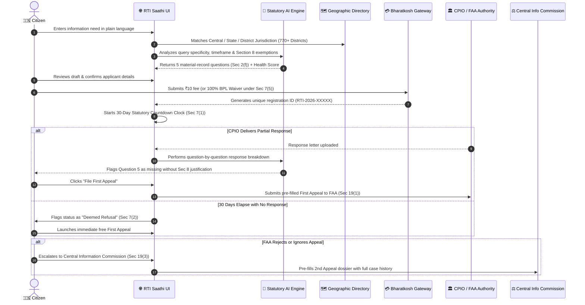

<div align="center">

# 🇮🇳 RTI Saathi (आरटीआई साथी)
### *Next-Generation Citizen Right to Information Gateway & Statutory AI Assistant*

**Empowering 1.4 Billion Citizens with AI-Guided Transparency, Statutory Legal Compliance, and End-to-End Appellate Redressal.**

[](https://nextjs.org/)
[](https://www.typescriptlang.org/)
[](https://tailwindcss.com/)
[](https://www.w3.org/WAI/standards-guidelines/wcag/)
[](https://digitalindia.gov.in)
[](https://dopt.gov.in)

[Live Demo](#-quick-start--demo) • [Architecture](#-system-architecture) • [Government & Policy](#-for-government-officials--policymakers) • [For Developers](#-for-engineers--developers) • [Product & ROI](#-for-product-managers--sales-leaders) • [Statutory Matrix](#-statutory-compliance-matrix)

---

</div>

## 📌 Executive Summary

The **Right to Information (RTI) Act, 2005** stands as the cornerstone of participatory democracy in India. However, over **35% of citizen RTI applications are dismissed, delayed, or rejected** before receiving substantive review. The primary failure points include:
1. **Interrogative Phrasing**: Citizens asking philosophical *"Why"* questions instead of requesting specific material records under Section 2(f).
2. **Jurisdictional Misrouting**: Filing state municipal issues on Central portals or vice-versa, resulting in non-refundable rejections.
3. **Statutory Exemption Violations**: Unknowingly seeking records exempt under Section 8(1).
4. **Appellate Drop-off**: Citizens abandoning valid requests when Public Information Officers (CPIOs) miss the 30-day deadline (*Deemed Refusal under Section 7(2)*).

**RTI Saathi** bridges these systemic gaps by pairing an **AI-Assisted Legal Drafting Copilot** with a **comprehensive 770+ District Geographic Directory**, **Bharatkosh payment simulation**, **30-day statutory timeline monitoring**, and **1-click First Appeal (FAA) & Second Appeal (CIC) escalation**.

---

## 🎯 Tailored Overview by Stakeholder

<table>
<tr>
<td width="50%" valign="top">

### 🏛️ For Government Officials & Policymakers
- **Reduces CPIO Burden**: Eliminates frivolous or vague requests before submission by enforcing Section 2(f) material-record framing.
- **Section 4 Proactive Disclosure Compliance**: Surfaces published circulars, budget allocations, and tenders automatically.
- **GIGW 3.0 & WCAG 2.2 AA Aligned**: High-contrast modes, text scaling (120%), bilingual Hindi/English, and low-data modes for rural 2G/3G networks.
- **3-Tier Appellate Redressal**: Complete adherence to the statutory hierarchy: *CPIO ➔ FAA (Sec 19(1)) ➔ CIC (Sec 19(3))*.

</td>
<td width="50%" valign="top">

### 💻 For Engineers & Software Architects
- **Modern Next.js 16 & Turbopack Core**: 600ms cold compilation, sub-second HMR, and zero client-side layout shifts.
- **Decoupled Services Layer**: Strict singleton service abstractions (`authService`, `rtiService`, `deadlineService`, `authorityService`, `appealService`, `aiService`).
- **Resilient Dual-Mode Storage**: PostgreSQL support with auto-reconciling in-memory fallback.
- **Strict Domain Models**: Universal TypeScript domain interfaces preventing state divergence.

</td>
</tr>
<tr>
<td width="50%" valign="top">

### 💼 For Product Managers & Sales Leaders
- **High-Conversion Citizen Funnel**: 5-step intuitive wizard replacing cumbersome 14-field bureaucratic web forms.
- **Action-Oriented Dashboard**: Immediate clarity on *"What do I need to do next?"* with deadline countdowns and 1-click appeal actions.
- **Payment Reconciliation Portal**: Resolves failed or pending gateway transactions without customer support tickets.
- **High Civic Impact**: Potential to serve 1.4B citizens, 2,000+ public authorities, and 770+ municipal districts.

</td>
<td width="50%" valign="top">

### ⚖️ For Legal Advocates & Civic Activists
- **Statutory Grounds Generator**: Automatically drafts First Appeal petitions citing specific violations (*Sec 7(1), Sec 7(2), Sec 7(8)*).
- **Official vs. AI Segregation**: Preserves sanctity of official CPIO letters while highlighting missing records in secondary analysis callouts.
- **100% BPL Fee Waiver**: Seamless implementation of Section 7(5) for Below Poverty Line citizens.

</td>
</tr>
</table>

---

## 🔄 End-to-End Citizen Journey Architecture



---

## 🏗️ System Architecture & Services Layer

RTI Saathi employs a decoupled, modular domain-driven architecture:

```
src/
├── app/                             # Next.js 16 App Router & API Endpoints
│   ├── api/
│   │   ├── authorities/route.ts     # Public authorities & CPIO/FAA lookup
│   │   ├── faqs/route.ts            # Categorized citizen statutory knowledge base
│   │   ├── rtis/route.ts            # RTI CRUD, metrics & submission
│   │   └── rtis/[id]/route.ts       # Single RTI lookup (GET) & Patch updates (PATCH)
│   ├── globals.css                  # Government design tokens & 65s marquee keyframes
│   ├── layout.tsx                   # Metadata, SEO tags & font hierarchy
│   └── page.tsx                     # Top-level state coordinator & view switch
├── components/                      # High-Performance UI Components
│   ├── Navbar.tsx                   # Top header with DEMO badge, language & preferences
│   ├── NoticeBar.tsx                # Continuous running marquee ticker (65s loop)
│   ├── LandingView.tsx              # 2-Column hero, 4-step guide, search & scope banner
│   ├── OnboardingView.tsx           # Request builder & 770+ District authority finder
│   ├── BuilderView.tsx              # 5-step drafting, Section 8 QC & ₹10 payment flow
│   ├── DashboardView.tsx            # Action Required card & clickable filter metrics
│   ├── RtiDetailView.tsx            # Official response workspace & First Appeal petition
│   ├── AuthoritiesView.tsx          # Public authorities directory & CPIO details
│   ├── ReconciliationView.tsx       # Multi-step bank payment recovery portal
│   ├── HelpView.tsx                 # Interactive 5-step guide, FAQ tabs & ticket desk
│   ├── ProfileView.tsx              # Citizen settings & Central Certified Document Vault
│   ├── ContextualHelp.tsx           # Floating help button & plain-language legal glossary
│   └── Footer.tsx                   # 4-column statutory footer with deep linking
└── services/                        # Business Logic & Data Abstractions
    ├── types.ts                     # Universal TypeScript interfaces & models
    ├── seedData.ts                  # Production-realistic seed records
    ├── authService.ts               # Citizen sessions & preference management
    ├── rtiService.ts                # Application CRUD, search & metric filtering
    ├── authorityService.ts          # Public authority directory & smart match engine
    ├── deadlineService.ts           # 30-day statutory calculation & holiday offsets
    ├── timelineService.ts           # Dynamic milestone event generator
    ├── documentService.ts           # Certified document repository & previews
    ├── notificationService.ts       # Alert dispatching & unread badge counters
    ├── appealService.ts             # First (FAA) & Second (CIC) Appeal petition generator
    └── aiService.ts                 # Assisted drafting & response discrepancy analyzer
```

---

## ⚖️ Statutory Compliance Matrix

RTI Saathi is architected strictly against the legal mandates of the **Right to Information Act, 2005** and the **RTI Rules, 2012**:

| Statutory Section | Legal Mandate | RTI Saathi Implementation |
|---|---|---|
| **Section 2(f)** | Definition of *"Information"* (material records only) | AI drafting copilot rewrites questions into concrete requests for records (*bills, work orders, muster rolls, test reports*). |
| **Section 3** | Citizen Right to Information | Open access to all Indian citizens with bilingual accessibility. |
| **Section 4(1)(b)** | Proactive Public Disclosures | Live search tool indexing published departmental tenders, manuals, and salary registers. |
| **Section 6(1)** | Application Filing in Hindi / English | Native language toggle seamlessly localizing queries and statutory terms. |
| **Section 7(1)** | 30-Calendar-Day Response Mandate | Real-time statutory countdown clock tracking the CPIO's delivery window. |
| **Section 7(2)** | **Deemed Refusal** Clause | Automatic status escalation to *"Deemed Refusal"* if 30 days lapse, triggering free appeal rights. |
| **Section 7(5)** | Fee Waiver for BPL Cardholders | 1-click BPL toggle waiving the ₹10 statutory fee with zero payment gateway friction. |
| **Section 8(1)** | Non-Disclosable Exemption Clauses | Automated pre-submission compliance check screening against defense, privacy, and commercial secrecy. |
| **Section 19(1)** | **First Appeal** to FAA within 30 Days | 1-click First Appeal wizard pre-populating historical grounds, registration tokens, and missing question logs. |
| **Section 19(3)** | **Second Appeal** to Central Info Commission | Structured petition generator for escalation to the CIC when FAA fails to provide relief. |

---

## 💻 For Engineers & Developers

### Local Setup & Prerequisites
- **Node.js**: `v18.17.0` or higher
- **npm**: `v9.0.0` or higher

```bash
# 1. Clone the repository
git clone https://github.com/harshit075/RTI.git
cd RTI

# 2. Install all dependencies
npm install

# 3. Start high-speed local dev server
npm run dev

# 4. Compile optimized production build
npm run build
npm run start
```

### REST API Documentation & Examples

#### 1. Retrieve Public Authorities Directory
```bash
curl -s http://localhost:3000/api/authorities | jq '.[0]'
```
```json
{
  "id": "morth",
  "name": "National Highways Authority of India (NHAI) / MoRTH",
  "department": "NHAI Project Implementation Unit",
  "ministry": "Ministry of Road Transport and Highways",
  "level": "Central",
  "cpioName": "Shri Manoj Pandey",
  "cpioDesignation": "General Manager (Tech) & CPIO",
  "cpioAddress": "G-5 & 6, Sector-10, Dwarka, New Delhi - 110075",
  "faaName": "Shri Rajesh Sharma",
  "faaDesignation": "Chief General Manager & First Appellate Authority"
}
```

#### 2. Retrieve RTI Case with Response Discrepancy Breakdown
```bash
curl -s http://localhost:3000/api/rtis/rti-road-jaipur-1245 | jq .
```
```json
{
  "id": "rti-road-jaipur-1245",
  "title": "Road Construction Expenditure — Ward 42, Jaipur",
  "status": "Response Received",
  "registrationNumber": "RTI-2026-001245",
  "answeredCount": 3,
  "totalQuestions": 5,
  "questionBreakdowns": [
    {
      "question": "Provide certified copies of final completion certificates and engineering quality audit reports.",
      "status": "Needs Review",
      "note": "Inspection report omitted by CPIO without citing Section 8 exemptions."
    }
  ],
  "aiAnalysis": "Question 5 was left unanswered. Under Section 7(1), withholding inspection records without invoking Section 8 exemptions is invalid. Strong statutory grounds exist to file a First Appeal under Section 19(1)."
}
```

---

## 🎨 Design System & Accessibility Standards

RTI Saathi adheres to the **Guidelines for Indian Government Websites (GIGW 3.0)** and **WCAG 2.2 Level AA**:

```css
/* Core Government Design Tokens */
--color-primary-navy:   #123B5D;   /* Official Trust Blue */
--color-bg-ice:         #F7F8FA;   /* Low Eye-Strain Canvas */
--color-text-charcoal:  #17212B;   /* WCAG AAA High Contrast Text */
--color-border-slate:   #D9E0E6;   /* Accessible Structural Divider */
--color-warning-amber:  #B7791F;   /* Statutory Deadline Highlight */
--color-success-green:  #16845B;   /* Disclosed Record Confirmation */
```

- **Screen Reader Optimized**: Complete `aria-label`, `aria-hidden`, and semantic landmark structure (`<header>`, `<main>`, `<nav>`, `<aside>`, `<footer>`).
- **Text Scaling**: Full dynamic layout scaling supporting 100% to 120% text zoom without clipping.
- **Low-Data Mode**: Image-light CSS rendering designed for low-connectivity environments.

---

## 📢 Practice & Demonstration Notice

> **Demonstration Environment Notice:** RTI Saathi is an educational and demonstration portal created to showcase modern, AI-assisted citizen service architecture under the RTI Act, 2005. In this environment, all application filing workflows, fee transactions, and CPIO responses are simulated for training, practice, and evaluation; no real banking charges are incurred and no actual government records are requested.

---

## 👥 Authors & Open-Source Civic Tech
- **Repository**: [harshit075/RTI](https://github.com/harshit075/RTI)
- **Branch**: `main`
- **License**: MIT
- Built with dedication for transparency, citizen empowerment, and digital governance.
