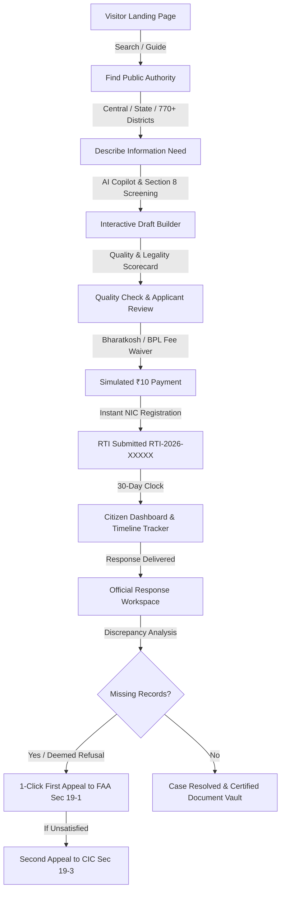

# RTI Saathi (आरटीआई साथी)
### *Citizen Right to Information Gateway & Statutory AI Assistant*

[](https://nextjs.org/)
[](https://www.typescriptlang.org/)
[](https://tailwindcss.com/)
[](https://www.w3.org/WAI/standards-guidelines/wcag/)
[](https://dopt.gov.in)

---

## 🏛️ Executive Summary

**RTI Saathi** is an intelligent, accessible citizen gateway designed to bridge the gap between Indian citizens and public authorities under the **Right to Information (RTI) Act, 2005**. 

While the RTI Act empowers citizens to seek public records, over **35% of citizen applications are rejected or delayed** due to common stumbling blocks:
1. **Interrogative Drafting Pitfalls**: Asking *"Why"* questions instead of requesting specific material records under Section 2(f).
2. **Jurisdictional Routing Errors**: Directing state/municipal queries to Central portals or vice versa.
3. **Statutory Exemption Misunderstandings**: Unintentionally requesting records covered under Section 8(1) exemptions.
4. **Appellate Abandonment**: Citizens failing to escalate when CPIOs miss the mandatory 30-day deadline (*Deemed Refusal under Section 7(2)*) or withhold key documents.

**RTI Saathi** solves these challenges through an end-to-end guided workflow that pairs **assisted drafting**, **geographic authority matching**, **statutory compliance checks**, **Bharatkosh payment simulation**, **30-day timeline monitoring**, and **automated First & Second Appeals (CIC)**.

---

## 🔄 The Complete Citizen Journey



---

## 🌟 Key Features & Innovations

### 1. 🤖 Statutory AI Drafting Copilot
- **Material Record Formulation**: Automatically transforms vague citizen queries (*"Why is my road broken?"*) into legally precise requests for material records (*sanction orders, bitumen expenditure vouchers, contractor tender agreements, engineer inspection certificates*).
- **Proactive Section 8 Screening**: Scans draft questions against statutory exemptions (*national security, cabinet papers, commercial confidence, third-party personal privacy*).
- **Real-Time Health Score**: Provides instant visual feedback on query specificity, timeframe constraints, and geographic scope.

### 2. 🗺️ Comprehensive Authority & Geographic Directory
- **Central Public Authorities**: Pre-mapped Central Ministries, Departments, and nodal CPIO / FAA contact records (*MoRTH, NHAI, Railways, UIDAI, EPFO, CPV Passport Division, UGC, Ministry of Finance*).
- **36 States & UTs • 770+ Districts**: Searchable database covering every district and local municipal corporation across India.
- **Jurisdiction Scope Alerts**: High-contrast guidance preventing accidental filing of state-level records on Central portals.

### 3. 💳 Bharatkosh Payment Simulation & BPL Fee Waiver
- **Rule 3 Compliance**: Simulates the standard ₹10 statutory application fee via UPI / QR Code, Credit/Debit Card, and Netbanking.
- **Section 7(5) BPL Waiver**: Integrated toggle for Below Poverty Line cardholders allowing instant 100% fee waiver.
- **Payment Reconciliation Portal**: Dedicated recovery flow for citizens whose bank deducted funds but haven't received a registration token within 24 hours.

### 4. ⏱️ 30-Day Statutory Countdown & Deemed Refusal Monitoring
- **Section 7(1) Clock**: Tracks the strict 30-calendar-day timeline from registration to delivery.
- **Deemed Refusal Alerts**: If 30 days elapse without a response, the application status automatically updates to **Deemed Refusal (Section 7(2))**, enabling a free First Appeal.

### 5. 📜 Official Response Workspace & AI Discrepancy Breakdown
- **Official Response Priority**: The CPIO's formal response letter and certified attachments are displayed as primary government records.
- **Point-by-Point Question Analysis**: Each question is graded as `Answered`, `Partially Answered`, or `Needs Review`.
- **Statutory Grounds for Appeal**: Highlights specific unanswered questions and generates statutory rationale for filing an appeal.

### 6. ⚖️ 1-Click First & Second (CIC) Appeals
- **Section 19(1) First Appeal**: Automatically pre-fills a formal petition to the First Appellate Authority (FAA) carrying over all historical reference numbers, grounds, and missing question logs.
- **Section 19(3) Second Appeal**: Structured petition generator for escalating unresolved disputes to the Central Information Commission (CIC).

### 7. ♿ Accessibility, Inclusivity & Localization (WCAG 2.2 AA)
- **Bilingual Interface**: Seamless 1-click toggle between **English** and **Hindi (हिंदी)** across all components and statutory terminology.
- **Text Scaling**: Switch between Normal (100%) and Large (120%) typography.
- **Low-Bandwidth Mode**: Optimized for rural 2G/3G connectivity.
- **Continuous Notice Ticker**: Smooth, hardware-accelerated 65s running marquee with hover-to-pause.
- **Contextual Help & Plain-Language Glossary**: Floating help button with FAQ lookup and plain-language definitions of statutory terms (*CPIO, FAA, CIC, Deemed Refusal, Section 4 Proactive Disclosure*).

---

## 🛠️ Technology Stack

| Layer | Technology | Purpose |
|---|---|---|
| **Framework** | [Next.js 16.3.2](https://nextjs.org/) (Turbopack, App Router) | Server-side rendering, static page generation, API routes |
| **Language** | [TypeScript 5](https://www.typescriptlang.org/) | Strict domain typing, type safety, and interface integrity |
| **Styling** | [Tailwind CSS 4](https://tailwindcss.com/) & Vanilla CSS | Curated government palette (`#123B5D` Navy, `#F7F8FA` Ice, `#F59E0B` Saffron, `#16845B` Green) |
| **Icons** | [Lucide React](https://lucide.dev/) | Clean, accessible semantic iconography |
| **Services Layer** | Modular TypeScript Service Singletons | Decoupled architecture (`authService`, `rtiService`, `authorityService`, `documentService`, `notificationService`, `appealService`, `deadlineService`, `timelineService`, `aiService`) |
| **Database Support** | PostgreSQL / Memory Fallback | Persistent relational storage with seamless in-memory fallback |

---

## 📁 Repository & Project Architecture

```
RTI/
├── src/
│   ├── app/
│   │   ├── api/
│   │   │   ├── authorities/route.ts       # Central & State public authorities API
│   │   │   ├── faqs/route.ts              # Categorized citizen FAQ repository
│   │   │   ├── rtis/route.ts              # RTI CRUD & submissions API
│   │   │   └── rtis/[id]/route.ts         # Single RTI lookup & PATCH updates
│   │   ├── globals.css                    # Design tokens, marquee & WCAG styling
│   │   ├── layout.tsx                     # Root HTML metadata & font definitions
│   │   ├── page.tsx                       # Main application state & view router
│   │   ├── login/page.tsx                 # Citizen login view
│   │   ├── signup/page.tsx                # Citizen registration view
│   │   └── forgot-password/page.tsx       # Credential recovery view
│   ├── components/
│   │   ├── Navbar.tsx                     # Government header with accessibility menu
│   │   ├── NoticeBar.tsx                  # Continuous running announcement ticker
│   │   ├── LandingView.tsx                # Balanced 2-column citizen homepage
│   │   ├── OnboardingView.tsx             # Interactive request & geo-authority finder
│   │   ├── BuilderView.tsx                # 5-step RTI drafting, QC & payment flow
│   │   ├── DashboardView.tsx              # Action-oriented application tracker
│   │   ├── RtiDetailView.tsx              # Official response workspace & appeal wizard
│   │   ├── AuthoritiesView.tsx            # Public authorities & CPIO/FAA directory
│   │   ├── ReconciliationView.tsx         # Payment verification & recovery portal
│   │   ├── HelpView.tsx                   # FAQ knowledge base & support tickets
│   │   ├── ProfileView.tsx                # Citizen settings & Central Document Vault
│   │   ├── ContextualHelp.tsx             # Floating help modal & legal glossary
│   │   ├── AuthView.tsx                   # Unified authentication views
│   │   └── Footer.tsx                     # 4-column statutory footer with deep links
│   ├── services/
│   │   ├── types.ts                       # Universal domain interfaces & models
│   │   ├── seedData.ts                    # Production-realistic seed records
│   │   ├── authService.ts                 # Citizen session & preference management
│   │   ├── rtiService.ts                  # Application CRUD & metric aggregations
│   │   ├── authorityService.ts            # Public authorities & smart match engine
│   │   ├── deadlineService.ts             # 30-day statutory calculation engine
│   │   ├── timelineService.ts             # Milestone event generator
│   │   ├── documentService.ts             # Certified document repository
│   │   ├── notificationService.ts         # Alerts & unread badge management
│   │   ├── appealService.ts               # First & Second Appeal petition generator
│   │   ├── aiService.ts                   # Drafting copilot & response analysis
│   │   └── index.ts                       # Central services export
│   ├── data/
│   │   ├── mockData.ts                    # Fallback seed data
│   │   └── geoData.ts                     # 36 States/UTs & 770+ Districts directory
│   └── lib/
│       └── db.ts                          # Relational database client
├── public/                                # Static government assets & documents
├── README.md                              # Complete project documentation
├── package.json                           # Dependencies & build scripts
└── next.config.ts                         # Next.js build configuration
```

---

## 🚀 Getting Started & Local Setup

### Prerequisites
- **Node.js**: v18.17.0 or higher
- **npm**: v9.0.0 or higher

### Installation

1. **Clone the repository:**
   ```bash
   git clone https://github.com/harshit075/RTI.git
   cd RTI
   ```

2. **Install dependencies:**
   ```bash
   npm install
   ```

3. **Run development server:**
   ```bash
   npm run dev
   ```

4. **Access the application:**
   Open [http://localhost:3000](http://localhost:3000) in your browser.

### Production Build & Verification

To compile and verify the production bundle:
```bash
npm run build
npm run start
```

---

## 📡 REST API Documentation

| Endpoint | Method | Description | Response Codes |
|---|---|---|---|
| `/api/authorities` | `GET` | Retrieve list of public authorities with CPIO and FAA details | `200 OK` |
| `/api/faqs` | `GET` | Retrieve categorized citizen statutory FAQs | `200 OK` |
| `/api/rtis` | `GET` | Retrieve all active and completed citizen RTI applications | `200 OK` |
| `/api/rtis` | `POST` | Create and register a new RTI application | `200 OK`, `400 Bad Request` |
| `/api/rtis/:id` | `GET` | Retrieve single application details with 5-question analysis breakdown | `200 OK`, `404 Not Found` |
| `/api/rtis/:id` | `PATCH` | Update status, payment ID, or file First/Second Appeal | `200 OK`, `404 Not Found` |

---

## ⚖️ Statutory Legal References

RTI Saathi is architected strictly according to the statutory provisions of the **Right to Information Act, 2005**:

- **Section 2(f)**: Definition of *"information"* — restricts valid requests to pre-existing material records (*memos, emails, orders, logbooks, contracts, reports, data material in electronic format*).
- **Section 3**: Statutory right of all Indian citizens to obtain information.
- **Section 4(1)(b)**: Mandatory proactive disclosure of organization structures, budgets, and officer directories.
- **Section 6(1)**: Application submission in writing or electronic means in English, Hindi, or regional official languages.
- **Section 7(1)**: Statutory requirement for CPIO to provide information or reject within **30 calendar days** (or 48 hours if concerning life and liberty).
- **Section 7(2)**: **Deemed Refusal** clause — CPIO's failure to respond within 30 days is legally treated as rejection.
- **Section 7(5)**: Mandatory **fee waiver** for Below Poverty Line (BPL) cardholders.
- **Section 8(1)**: Specific exemptions from disclosure (*national security, cabinet deliberations, trade secrets, third-party private data*).
- **Section 19(1)**: **First Appeal** to the senior First Appellate Authority (FAA) within 30 days of decision or expiry of 30-day window.
- **Section 19(3)**: **Second Appeal** to the Central Information Commission (CIC) within 90 days of FAA decision.

---

## 📢 Practice & Demonstration Notice

> **Demonstration Environment Notice:** RTI Saathi is an educational and demonstration portal created to illustrate modern, AI-assisted citizen service design under the RTI Act, 2005. In this environment, all application filing workflows, fee transactions, and CPIO responses are simulated for training, practice, and evaluation; no real banking charges are incurred and no actual government records are requested.

---

## 👨‍💻 Team & Contribution
- **Repository**: [harshit075/RTI](https://github.com/harshit075/RTI)
- **Branch**: `main`
- Built with ❤️ for citizen empowerment, transparency, and accessible digital governance.
